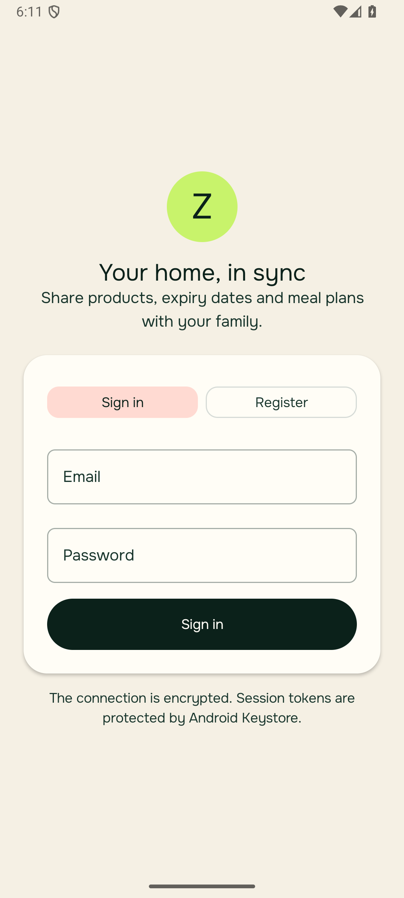
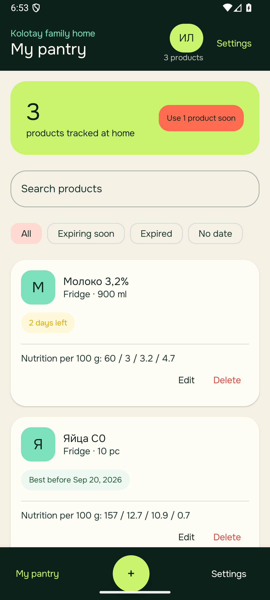
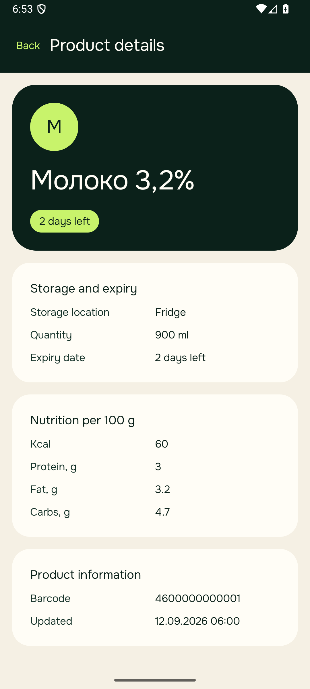
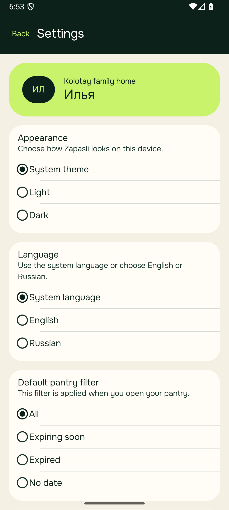

# Zapasli Android

[](https://github.com/sokolkolotay/zapasli-android/actions/workflows/android-ci.yml)

Android-приложение для семейного учёта домашних продуктов: сроки годности, места хранения, штрихкоды и КБЖУ.

- Сайт продукта: [zapasli.sokolkolotaj.ru](https://zapasli.sokolkolotaj.ru/)
- Production API: [api.zapasli.sokolkolotaj.ru](https://api.zapasli.sokolkolotaj.ru/health/ready)
- Swagger/OpenAPI: [api.zapasli.sokolkolotaj.ru/swagger](https://api.zapasli.sokolkolotaj.ru/swagger)

## Возможности дипломной версии

- регистрация, вход, восстановление сессии и выход через собственный HTTPS API;
- защищённое хранение токенов через AES-256-GCM и Android Keystore;
- локальная Room-кладовая с добавлением, редактированием и удалением продуктов;
- список продуктов в карточках и отдельный детальный экран;
- поиск и фильтры: все, скоро испортятся, просроченные, без срока;
- количество, место хранения, срок годности, штрихкод и КБЖУ;
- сканирование EAN/UPC через CameraX и встроенную модель ML Kit;
- автозаполнение названия и КБЖУ из Open Food Facts с ручным fallback;
- отдельные настройки фильтра по умолчанию, System/Light/Dark и System/English/Русский;
- полноценный offline-сценарий после ранее выполненного входа;
- единая визуальная система Android и сайта: ink, cream, lime, mint и coral.

Семейная серверная синхронизация, OCR чеков, личные цели питания и рекомендации блюд оставлены в продуктовом roadmap и не выдаются за завершённые функции дипломного MVP.

## Скриншоты

<p align="center">
  
  
  
  
</p>

Скриншоты основных экранов воспроизводимо создаются instrumented-тестом `ShowcaseScreenTest` на Android-эмуляторе.

## Соответствие требованиям диплома

| Требование раздела 2 | Реализация |
|---|---|
| Kotlin, Coroutines, Retrofit, Dagger Hilt | Используются в production-коде |
| Удалённый сервер | Собственный публичный API с HTTPS и Swagger |
| Список объектов карточками | Список продуктов на Compose/Material 3 |
| Переход в детальный вид | Нажатие на карточку открывает экран продукта |
| Settings: фильтр, тема, язык | Отдельный экран настроек, значения сохраняются |
| Минимум один unit-тест | 20 unit-тестов |
| Offline | CRUD и данные Room доступны без сети; cached auth-session |
| Английский по умолчанию и русский | `values` и `values-ru`, выбор языка через AndroidX |
| Single Activity | Одна `MainActivity`, Navigation 3 и `@Composable`-экраны |
| GitHub Actions | test, lint, debug APK и androidTest APK |
| README со скриншотами | Этот документ и четыре актуальных скриншота |

## Технологии и документация

- [Kotlin](https://kotlinlang.org/docs/home.html), [Kotlin Coroutines](https://kotlinlang.org/docs/coroutines-overview.html)
- [Jetpack Compose](https://developer.android.com/compose), [Material 3](https://m3.material.io/), [Navigation 3](https://developer.android.com/guide/navigation/navigation-3)
- [Dagger Hilt](https://developer.android.com/training/dependency-injection/hilt-android)
- [Room](https://developer.android.com/training/data-storage/room), [DataStore](https://developer.android.com/topic/libraries/architecture/datastore)
- [Retrofit](https://square.github.io/retrofit/), [OkHttp](https://square.github.io/okhttp/), [Kotlin Serialization](https://github.com/Kotlin/kotlinx.serialization)
- [CameraX](https://developer.android.com/media/camera/camerax), [ML Kit Barcode Scanning](https://developers.google.com/ml-kit/vision/barcode-scanning/android)
- [Per-app language preferences](https://developer.android.com/guide/topics/resources/app-languages)
- [Open Food Facts API](https://openfoodfacts.github.io/openfoodfacts-server/api/)

Сборка использует Android Gradle Plugin 9.4.0, Gradle 9.7.1, Kotlin 2.4.20, compileSdk/targetSdk 37 и minSdk 26. Application ID: `ru.zapasli.app`.

## Локальный запуск

1. Откройте корень репозитория в Android Studio.
2. Дождитесь Gradle Sync.
3. Запустите конфигурацию `app` на эмуляторе или устройстве с Android 8.0+.

CI-эквивалент для Windows:

```powershell
.\gradlew.bat testDebugUnitTest lintDebug assembleDebug assembleDebugAndroidTest
```

Полный набор тестов на запущенном эмуляторе:

```powershell
.\gradlew.bat connectedDebugAndroidTest
```

## Архитектура

- `domain` — модели и контракты auth, каталога и кладовой;
- `data` — Retrofit/OkHttp, защищённая сессия, Open Food Facts и offline repository;
- `core/database` — Room, DAO и mapping;
- `core/preferences` — несекретные настройки интерфейса в DataStore;
- `ui/auth`, `ui/pantry`, `ui/details`, `ui/settings`, `ui/scanner` — экраны и ViewModel;
- `Navigation.kt` — единый Single Activity navigation graph.

Правила работы с ключами, токенами и уязвимостями описаны в [SECURITY.md](SECURITY.md).

## Проверки

Последний локальный release-check:

- 20 unit-тестов — успешно;
- Android Lint — `No issues found`;
- debug APK и androidTest APK — собраны;
- 10 instrumented-тестов на Android 16 — успешно;
- ручной production auth smoke: регистрация, restart/restore, offline fallback и logout;
- manifest запрещает cleartext traffic и backup защищённой сессии.

## Milestones

- `v0.1.0-offline` — локальная кладовая и offline CRUD;
- `v0.2.0-barcode` — EAN/UPC и Open Food Facts;
- `v0.3.0-auth` — production auth, обязательные Settings/Details, RU/EN, единый visual system.

Теги создаются после локальных проверок, успешного CI и аудита коммита на секреты и локальные файлы.

## Источник данных

Название и КБЖУ могут загружаться из [Open Food Facts](https://world.openfoodfacts.org/). База распространяется по Open Database License (ODbL). Полученные значения используются только для автозаполнения и должны проверяться пользователем.

Репозиторий задания Netology используется только как источник требований и не изменяется.
